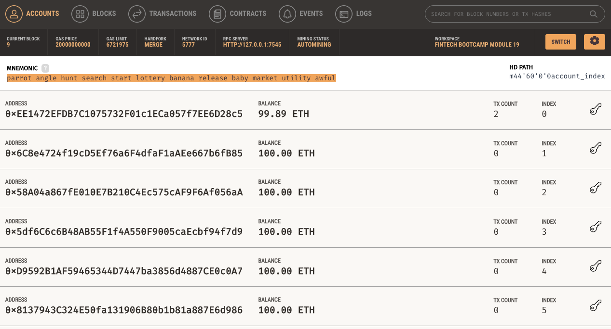
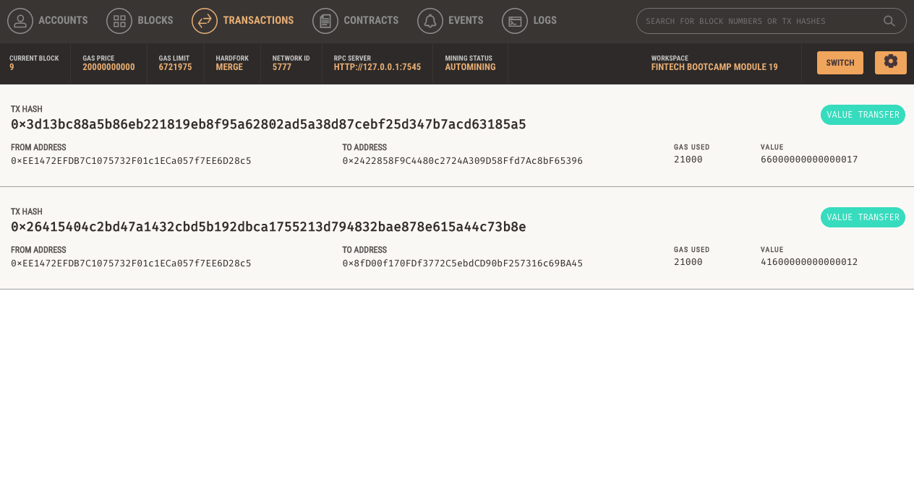
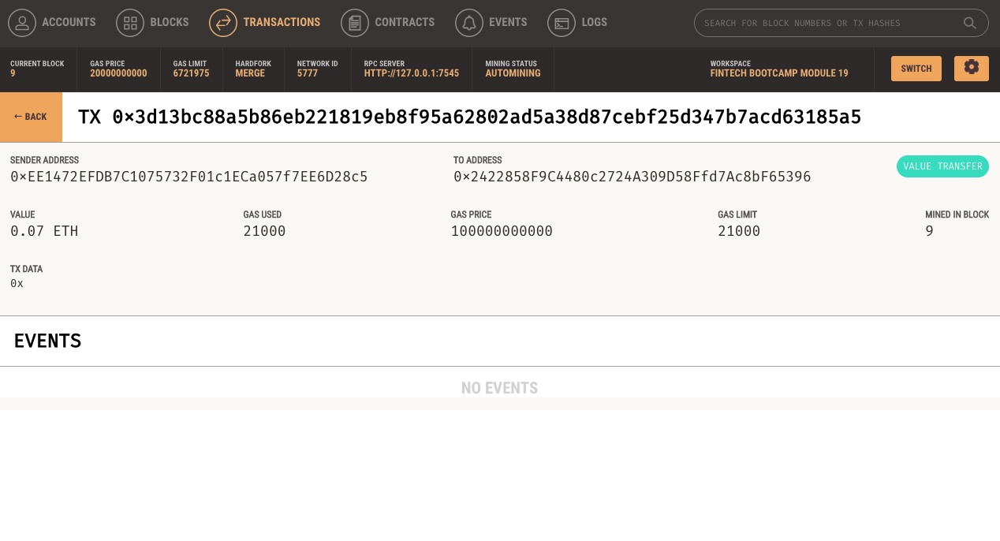

## Unit 19 Homework: Cryptocurrency Wallet

### Files:

- [Code](krypto_jobs.py)
- [Functions](crypto_wallet.py)

---

### Instructions:

Specifically, you will assume the perspective of a KryptoJobs2Go customer in order to do the following:

* Generate a new Ethereum account instance by using the mnemonic seed phrase provided by Ganache.

* Fetch and display the account balance associated with your Ethereum account address.

* Calculate the total value of an Ethereum transaction, including the gas estimate, that pays a KryptoJobs2Go candidate for their work.

* Digitally sign a transaction that pays a KryptoJobs2Go candidate, and send this transaction to the Ganache blockchain.

* Review the transaction hash code associated with the validated blockchain transaction.

*Note: Had to change gas price in the raw_tx from "0" to "100000000000" within the crypto_wallet.py file.

---

### Streamlit App

### Ganache

### Transactions

### Transaction Confirmations

